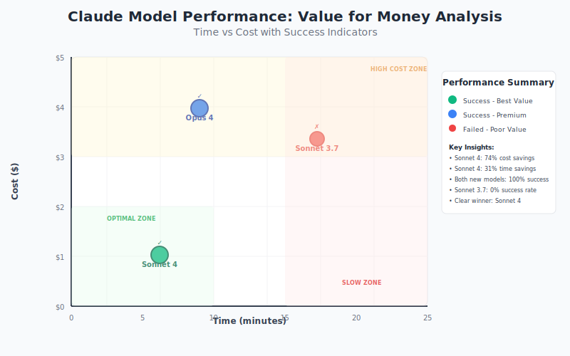

Claude 4 achieved a groundbreaking 72.7% on SWE-bench Verified, surpassing OpenAI's latest models and setting a new standard for AI-assisted development. After 24 hours of intensive testing with challenging refactoring scenarios, I can confirm these benchmarks translate to remarkable real-world capabilities.

<!--truncate-->

Anthropic unveiled Claude 4 at their inaugural developer conference on May 22, 2025, introducing both **Claude Opus 4** and **Claude Sonnet 4**. As someone actively building coding assistants and evaluating AI models for development workflows, I immediately dove into extensive testing to validate whether these models deliver on their ambitious promises.

## What Sets Claude 4 Apart

Claude 4 represents more than an incremental improvement—it's Anthropic's strategic push toward "autonomous workflows" for software engineering. Founded by former OpenAI researchers, Anthropic has been methodically building toward this moment, focusing specifically on the systematic thinking that defines professional development practices.

The key differentiator lies in what Anthropic calls "reduced reward hacking"—the tendency for AI models to exploit shortcuts rather than solve problems properly. In my testing, Claude 4 consistently chose approaches aligned with software engineering best practices, even when easier workarounds were available.

## Benchmark Performance Analysis

The SWE-bench Verified results tell a compelling story about real-world coding capabilities:

_Figure 1: SWE-bench Verified performance comparison showing Claude 4's leading position in practical software engineering tasks_

- **Claude Sonnet 4**: 72.7%
- **Claude Opus 4**: 72.5%
- **OpenAI Codex 1**: 72.1%
- **OpenAI o3**: 69.1%
- **Google Gemini 2.5 Pro Preview**: 63.2%

### Methodology Transparency

Some developers have raised questions about Anthropic's "parallel test-time compute" methodology and data handling practices. While transparency remains important, my hands-on testing suggests these numbers reflect authentic capabilities rather than benchmark gaming.

## Real-World Testing: Advanced Refactoring Scenarios

I focused my initial evaluation on scenarios that typically expose AI coding limitations: intricate, multi-faceted problems requiring deep codebase understanding and architectural awareness.

### The Ultimate Test: Resolving Interconnected Test Failures

My most revealing challenge involved a test suite with 10+ unit tests where 3 consistently failed during refactoring work on a complex Rust-based project. These weren't simple bugs—they represented interconnected issues requiring understanding of:

- Data validation logic architecture
- Asynchronous processing workflows
- Edge case handling in parsing systems
- Cross-component interaction patterns

After hitting limitations with Claude Sonnet 3.7, I switched to Claude Opus 4 for the same challenge. The results were transformative.

### Performance Comparison Across Models

The following table illustrates the dramatic difference in capability:

| Model                 | Time Required | Cost  | Success Rate    | Solution Quality               | Iterations |
| --------------------- | ------------- | ----- | --------------- | ------------------------------ | ---------- |
| **Claude Opus 4**     | 9 minutes     | $3.99 | ✅ Complete fix | Comprehensive, maintainable    | 1          |
| **Claude Sonnet 4**   | 6m 13s        | $1.03 | ✅ Complete fix | Excellent + documentation      | 1          |
| **Claude Sonnet 3.7** | 17m 16s       | $3.35 | ❌ Failed       | Modified tests instead of code | 4          |

_Figure 2: Comparative analysis showing Claude 4's superior efficiency and accuracy in resolving multi-faceted coding challenges_

### Key Observations

**Single-Iteration Resolution**: Both Claude 4 variants resolved all three failing tests in one comprehensive pass, modifying 15+ of lines across multiple files with zero hallucinations.

**Architectural Understanding**: Rather than patching symptoms, the models demonstrated genuine comprehension of system architecture and implemented solutions that strengthened overall design patterns.

> **Engineering Discipline**: Most critically, both models adhered to my instruction not to modify tests—a principle Claude Sonnet 3.7 eventually abandoned under pressure.

## Revolutionary Capabilities

### System-Level Reasoning

Claude 4 excels at maintaining awareness of broader architectural concerns while implementing localized fixes. This system-level thinking enables it to anticipate downstream effects and implement solutions that enhance long-term maintainability.

### Precision Under Pressure

The models consistently chose methodical, systematic approaches over quick fixes. This reliability becomes crucial in production environments where shortcuts can introduce technical debt or system instabilities.

### Agentic Development Integration

Claude 4 demonstrates particular strength in agentic coding environments like Forge, maintaining context across multi-file operations while executing comprehensive modifications. This suggests optimization specifically for sophisticated development workflows.

## Pricing and Availability

### Cost Structure

| Model        | Input (per 1M tokens) | Output (per 1M tokens) |
| ------------ | --------------------- | ---------------------- |
| **Opus 4**   | $15                   | $75                    |
| **Sonnet 4** | $3                    | $15                    |

### Platform Access

Claude 4 is available through:

- [Amazon Bedrock](https://aws.amazon.com/about-aws/whats-new/2025/05/anthropics-claude-4-foundation-models-amazon-bedrock/)
- [Google Cloud's Vertex AI](https://cloud.google.com/vertex-ai/generative-ai/docs/partner-models/claude)
- [OpenRouter](https://openrouter.ai/anthropic/claude-sonnet-4)
- [Anthropic API](https://www.anthropic.com/news/claude-4)

## Initial Assessment: A Paradigm Shift

After intensive testing, Claude 4 represents a qualitative leap in AI coding capabilities. The combination of benchmark excellence and real-world performance suggests we're witnessing the emergence of truly agentic coding assistance.

### What Makes This Different

- **Reliability**: Consistent adherence to engineering principles under pressure
- **Precision**: Single-iteration resolution of multi-faceted problems
- **Integration**: Seamless operation within sophisticated development environments
- **Scalability**: Maintained performance across varying problem dimensions

### Looking Forward

The true test will be whether Claude 4 maintains these capabilities under extended use while proving reliable for mission-critical development work. Based on initial evidence, we may be witnessing the beginning of a new era in AI-assisted software engineering.

Claude 4 delivers on its ambitious promises with measurable impact on development productivity and code quality. For teams serious about AI-assisted development, this release warrants immediate evaluation.
