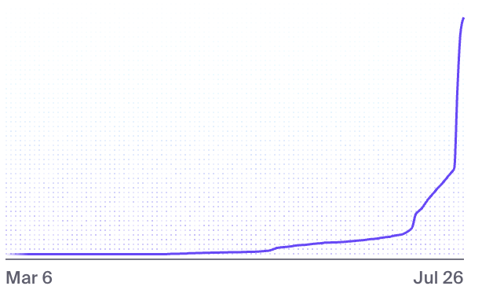
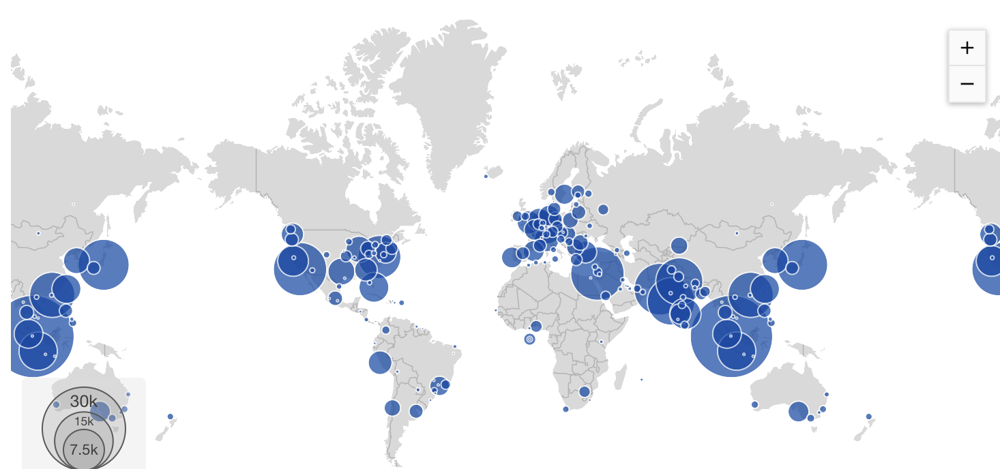
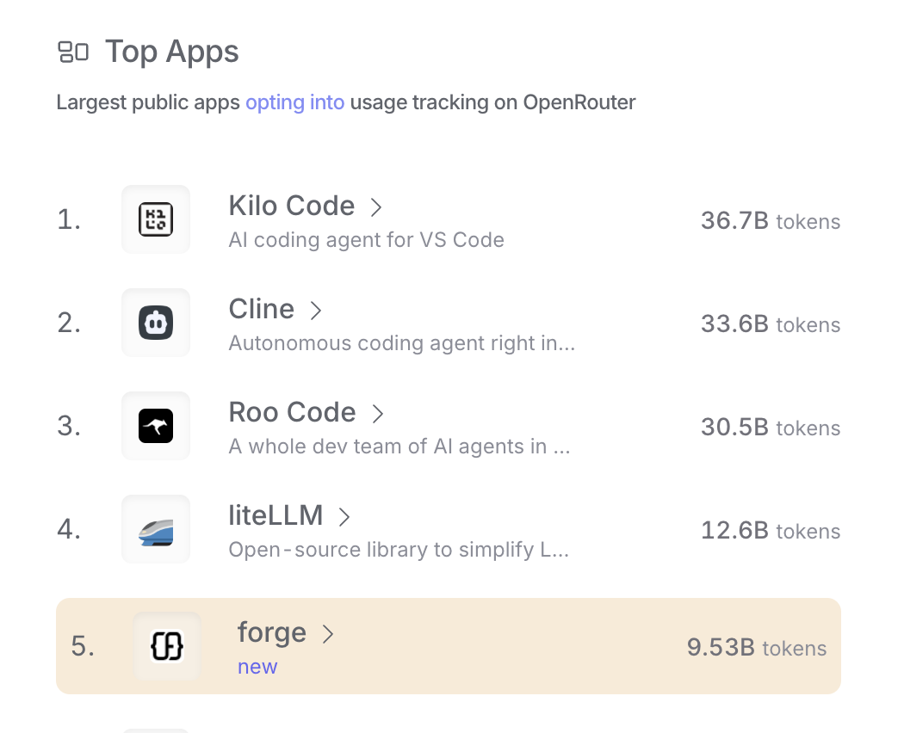

What started as a small early access experiment blew up in the best way possible. Thanks to you, our incredible community, we saw a 17x surge in signups and a 10x spike in usage in just a few days - results that validated our hypothesis about developer demand for AI-powered development tools.

This explosive growth was the ultimate validation. It taught us exactly what different kinds of developers need from Forge. Our most active users were making thousands of AI requests every day, racking up over $500/day in AI inference costs and showing us just how powerful this thing can be.

<!-- truncate -->

### What We Learned: Different Devs, Different Needs

Our early access taught us something fascinating: developers use Forge in wildly different ways. Some were kicking the tires with small projects, while our power users were making thousands of AI requests a day and weaving Forge into their core workflows.

This was exactly what we hoped to see. Our top 1% of users weren't just pushing the limits; they were showing that developers could get hooked on Forge for everything from quick experiments to marathon coding sessions. That level of engagement and reliance on our tool told us we were onto something special.

The unlimited early access plan did its job. We got a crash course in how people use Forge in the real world, and it proved that this tool is genuinely useful for all kinds of developers.

### New Tiers for Every Kind of Developer

Based on what we learned, we've rolled out a new pricing structure that makes sense for how people actually use Forge:

**Free Tier**
Comes with a **dynamic request limit** that adjusts based on server load (usually 10-50 requests a day). It's a permanent free tier, not a limited trial, so you can really get a feel for how Forge works.

**Pro Plan**
Already live, and a lot of our most active users have already jumped on board. For $20 a month, you get up to 1,000 AI requests a day. It's for developers who are using Forge regularly and want to scale up their usage without worrying about limits.

**Max Plan**
The best part? Now live and built for the power users we saw who were completely hooked on Forge. For $100 a month, you get up to 5,000 AI requests a day. It's for those of you who've realized you can't go back to your old workflow because you love using Forge that much.

### The Numbers Speak for Themselves

The data from our early access says it all:

- 17x growth in developer signups
- 10x increase in token usage
- Hundreds of developers successfully upgrading to Pro

These aren't just numbers on a screen; they represent real developers solving real problems and building cool stuff with Forge.

### All Tiers Are Live

We've poured all this momentum into our full pricing lineup. The Max plan is built on everything we learned about heavy usage, and our whole pricing structure is designed around how developers actually work..

This is more than a pricing update; it's a new chapter for Forge, driven by the incredible things you've built. Thank you for being part of our story.

Join us on [Discord](https://discord.com/invite/kRZBPpkgwq) to see what's next and show us what you're building.
