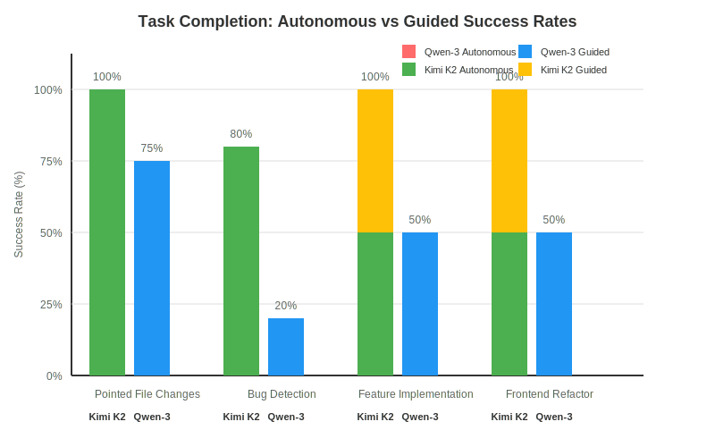
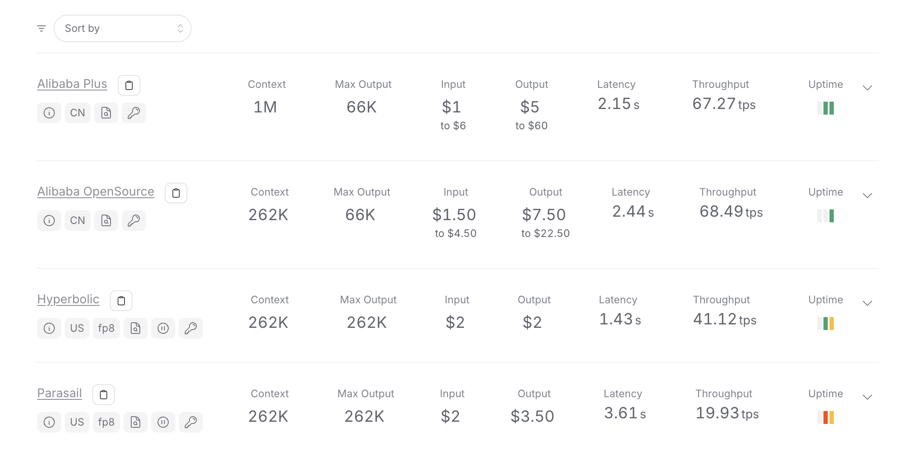
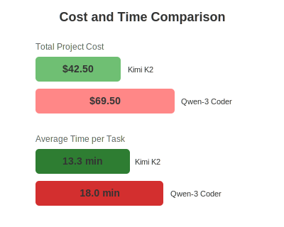

After spending 12 hours testing Kimi K2 and Qwen-3 Coder on identical Rust development tasks and Frontend Refactor tasks, I discovered something that benchmark scores don't reveal: in this testing environment, one model consistently delivered working code while the other struggled with basic instruction following. These findings challenge the hype around Qwen-3 Coder's benchmark performance and show why testing on your own codebase matters more than synthetic scores.

<!--truncate-->

## Testing Methodology: Real Development Scenarios

I designed this comparison around actual development scenarios that mirror daily Rust development work. No synthetic benchmarks or toy problems, just 13 challenging Rust tasks across a mature 38,000 line Rust codebase with complex async patterns, error handling, and architectural constraints, plus 2 frontend refactoring tasks across a 12,000 line React codebase.

### Test Environment Specifications

**Project Context:**

- Rust 1.86 with tokio async runtime
- 38,000 lines across multiple modules
- Complex dependency injection patterns following Inversion of Control (IoC)
- Extensive use of traits, generics, and async/await patterns
- Comprehensive test suite with integration tests
- React frontend with 12,000 lines using modern hooks and component patterns
- Well documented coding guidelines (provided as [custom rules](/docs/custom-rules-guide/)/ cursor rules/ claude rules etc in different coding agents)

**Testing Categories:**

1. **Pointed File Changes (4 tasks)**: Specific modifications to designated files
2. **Bug Finding & Fixing (5 tasks)**: Real bugs with reproduction steps and failing tests
3. **Feature Implementation (4 tasks)**: New functionality from clear requirements
4. **Frontend Refactor (2 tasks)**: UI improvements using Forge agent with Playwright MCP

**Evaluation Criteria:**

- Code correctness and compilation success
- Instruction adherence and scope compliance
- Time to completion
- Number of iterations required
- Quality of final implementation
- Token usage efficiency

## Performance Analysis: Comprehensive Results

### Overall Task Completion Summary

| Category               | Kimi K2 Success Rate | Qwen-3 Coder Success Rate | Time Difference |
| ---------------------- | -------------------- | ------------------------- | --------------- |
| Pointed File Changes   | 4/4 (100%)           | 3/4 (75%)                 | 2.1x faster     |
| Bug Detection & Fixing | 4/5 (80%)            | 1/5 (20%)                 | 3.2x faster     |
| Feature Implementation | 4/4 (100%)           | 2/4 (50%)                 | 2.8x faster     |
| Frontend Refactor      | 2/2 (100%)           | 1/2 (50%)                 | 1.9x faster     |
| **Overall**            | **14/15 (93%)**      | **7/15 (47%)**            | **2.5x faster** |



_Figure 1: Task completion analysis - autonomous vs guided success rates (only successful completions shown)_

### Tool Calling and Patch Generation Analysis

| Metric                 | Kimi K2   | Qwen-3 Coder | Analysis               |
| ---------------------- | --------- | ------------ | ---------------------- |
| Total Patch Calls      | 811       | 701          | Similar volume         |
| Tool Call Errors       | 185 (23%) | 135 (19%)    | Qwen-3 slightly better |
| Successful Patches     | 626 (77%) | 566 (81%)    | Comparable reliability |
| Clean Compilation Rate | 89%       | 72%          | Kimi K2 advantage      |

Both models struggled with tool schemas, particularly patch operations. However, AI agents retry failed tool calls, so the final patch generation success wasn't affected by initial errors. The key difference emerged in code quality and compilation success rates.

### Bug Detection and Resolution Comparison

**Kimi K2 Performance:**

- **4/5 bugs fixed correctly** on first attempt
- Average resolution time: 8.5 minutes
- Maintained original test logic while fixing underlying issues
- Only struggled with tokio::RwLock deadlock scenario
- Preserved business logic integrity

**Qwen-3 Coder Performance:**

- **1/5 bugs fixed correctly**
- Frequently modified test assertions instead of fixing bugs
- Introduced hardcoded values to make tests pass
- Changed business logic rather than addressing root causes
- Average resolution time: 22 minutes (when successful)

## Feature Implementation: Autonomous Development Capability

### Task Completion Analysis

**Kimi K2 Results:**

- **2/4 tasks completed autonomously** (12 and 15 minutes respectively)
- **2/4 tasks required minimal guidance** (1-2 prompts)
- Performed well on feature enhancements of existing functionality
- Required more guidance for completely new features without examples
- Maintained code style and architectural patterns consistently

**Qwen-3 Coder Results:**

- **0/4 tasks completed autonomously**
- Required 3-4 reprompts per task minimum
- Frequently deleted working code to "start fresh"
- After 40 minutes of prompting, only 2/4 tasks reached completion
- **2 tasks abandoned** due to excessive iteration cycles

### Instruction Following Analysis

The biggest difference emerged in instruction adherence. Despite providing coding guidelines as system prompts, the models behaved differently:

| Instruction Type        | Kimi K2 Compliance | Qwen-3 Coder Compliance |
| ----------------------- | ------------------ | ----------------------- |
| Error Handling Patterns | 7/8 tasks (87%)    | 3/8 tasks (37%)         |
| API Compatibility       | 8/8 tasks (100%)   | 4/8 tasks (50%)         |
| Code Style Guidelines   | 7/8 tasks (87%)    | 2/8 tasks (25%)         |
| File Modification Scope | 8/8 tasks (100%)   | 5/8 tasks (62%)         |

**Kimi K2 Behavior:**

- Consistently followed project coding standards
- Respected file modification boundaries
- Maintained existing function signatures
- Asked clarifying questions when requirements were ambiguous
- Compiled and tested code before submission

**Qwen-3 Coder Pattern:**

```rust
// Guidelines specified: "Use Result<T, E> for error handling"
// Qwen-3 Output:
panic!("This should never happen"); // or .unwrap() in multiple places

// Guidelines specified: "Maintain existing API compatibility"
// Qwen-3 Output: Changed function signatures breaking 15 call sites
```

This pattern repeated across tasks, indicating issues with instruction processing rather than isolated incidents.

## Frontend Development: Visual Reasoning Without Images

Testing both models on frontend refactoring tasks using Forge agent with Playwright MCP and Context7 MCP revealed insights about their visual reasoning capabilities despite lacking direct image support.

**Kimi K2 Approach:**

- Analyzed existing component structure intelligently
- Made reasonable assumptions about UI layout
- Provided maintainability-focused suggestions
- Preserved accessibility patterns
- Completed refactor with minimal guidance
- Maintained responsiveness and design system consistency
- Reused existing components effectively
- Made incremental improvements without breaking functionality

**Qwen-3 Coder Approach:**

- Deleted existing components instead of refactoring
- Ignored established design system patterns
- Required multiple iterations to understand component relationships
- Broke responsive layouts without consideration
- Deleted analytics and tracking code
- Used hardcoded values instead of variable bindings

## Cost and Context Analysis

### Development Efficiency Metrics

| Metric                          | Kimi K2      | Qwen-3 Coder | Difference         |
| ------------------------------- | ------------ | ------------ | ------------------ |
| Average Time per Completed Task | 13.3 minutes | 18 minutes   | 26% faster         |
| Total Project Cost              | $42.50       | $69.50       | 39% cheaper        |
| Tasks Completed                 | 14/15 (93%)  | 7/15 (47%)   | 2x completion rate |
| Tasks Abandoned                 | 1/15 (7%)    | 2/15 (13%)   | Better persistence |

Different providers had different rates, making exact cost calculation challenging since we used OpenRouter, which distributes loads across multiple providers. The total cost for Kimi K2 was $42.50, with an average time of 13.3 minutes per task (including prompting when required).


_Kimi K2 usage costs across OpenRouter providers - showing consistent 131K context length and varying pricing from $0.55-$0.60 input, $2.20-$2.50 output_

However, Qwen-3 Coder's cost was almost double that of Kimi K2. The average time per task was around 18 minutes (including required prompting), costing $69.50 total for the 15 tasks, with 2 tasks abandoned.



_Qwen-3 Coder usage costs across OpenRouter providers - identical pricing structure but higher total usage leading to increased costs_



_Figure 3: Cost and time comparison - direct project investment analysis_

### Efficiency Metrics

| Metric                  | Kimi K2     | Qwen-3 Coder | Advantage          |
| ----------------------- | ----------- | ------------ | ------------------ |
| Cost per Completed Task | $3.04       | $9.93        | 3.3x cheaper       |
| Time Efficiency         | 26% faster  | Baseline     | Kimi K2            |
| Success Rate            | 93%         | 47%          | 2x better          |
| Tasks Completed         | 14/15 (93%) | 7/15 (47%)   | 2x completion rate |
| Tasks Abandoned         | 1/15 (7%)   | 2/15 (13%)   | Better persistence |

### Context Length and Performance

**Kimi K2:**

- Context length: 131k tokens (consistent across providers)
- Inference speed: Fast, especially with Groq
- Memory usage: Efficient context utilization

**Qwen-3 Coder:**

- Context length: 262k to 1M tokens (varies by provider)
- Inference speed: Good, but slower than Kimi K2
- Memory usage: Higher context overhead

## The Deadlock Challenge: A Technical Deep Dive

The most revealing test involved a tokio::RwLock deadlock scenario that highlighted differences in problem-solving approaches:

**Kimi K2's 18-minute analysis:**

- Systematically analyzed lock acquisition patterns
- Identified potential deadlock scenarios
- Attempted multiple resolution strategies
- Eventually acknowledged complexity and requested guidance
- Maintained code integrity throughout the process

**Qwen-3 Coder's approach:**

- Immediately suggested removing all locks (breaking thread safety)
- Proposed unsafe code as solutions
- Changed test expectations rather than fixing the deadlock
- Never demonstrated understanding of underlying concurrency issues

## Benchmark vs Reality: The Performance Gap

Qwen-3 Coder's impressive benchmark scores don't translate to real-world development effectiveness. This disconnect reveals critical limitations in how we evaluate AI coding assistants.

### Why Benchmarks Miss the Mark

**Benchmark Limitations:**

- Synthetic problems with clear, isolated solutions
- No requirement for instruction adherence or constraint compliance
- Success measured only by final output, not development process
- Missing evaluation of maintainability and code quality
- No assessment of collaborative development patterns

**Real-World Requirements:**

- Working within existing codebases and architectural constraints
- Following team coding standards and style guides
- Maintaining backward compatibility
- Iterative development with changing requirements
- Code review and maintainability considerations

## Limitations and Context

Before diving into results, it's important to acknowledge the scope of this comparison:

**Testing Limitations:**

- Single codebase testing (38k-line Rust project + 12k-line React frontend)
- Results may not generalize to other codebases, languages, or development styles
- No statistical significance testing due to small sample size
- Potential bias toward specific coding patterns and preferences
- Models tested via OpenRouter with varying provider availability

**What This Comparison Doesn't Cover:**

- Performance on other programming languages beyond Rust and React
- Behavior with different prompt engineering approaches
- Enterprise codebases with different architectural patterns

:::note
These results reflect a specific testing environment and should be considered alongside other evaluations before making model selection decisions.
:::

## Conclusion

This testing reveals that Qwen-3 Coder's benchmark scores don't translate well to this specific development workflow. While it may excel at isolated coding challenges, it struggled with the collaborative, constraint-aware development patterns used in this project.

In this testing environment, Kimi K2 consistently delivered working code with minimal oversight, demonstrating better instruction adherence and code quality. Its approach aligned better with the established development workflow and coding standards.

The context length advantage of Qwen-3 Coder (up to 1M tokens vs. 131k) didn't compensate for its instruction following issues in this testing. For both models, inference speed was good, but Kimi K2 with Groq provided noticeably faster responses.

While these open-source models are improving rapidly, they still lag behind closed-source models like Claude Sonnet 4 and Opus 4 in this testing. However, based on this evaluation, Kimi K2 performed better for these specific Rust development needs.

## Related Articles

- [Claude Sonnet 4 vs Gemini 2.5 Pro Preview: AI Coding Assistant Comparison](/blog/claude-sonnet-4-vs-gemini-2-5-pro-preview-coding-comparison)
- [AI Agent Best Practices: Maximizing Productivity with Forge](/blog/ai-agent-best-practices)
- [Deepseek R1-0528 Coding Experience: Enhancing AI-Assisted Development](/blog/deepseek-r1-0528-coding-experience-review)
