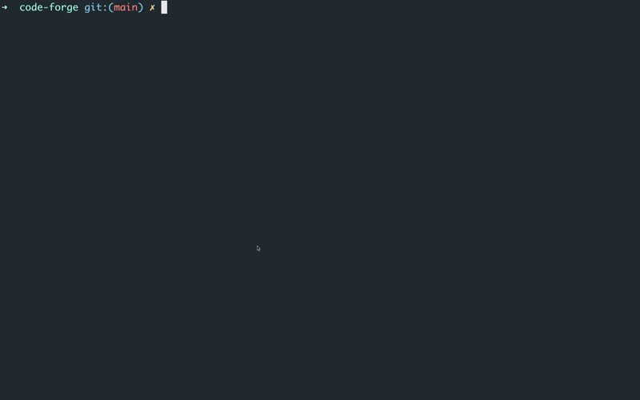

# Switching Between AI Models

## How to Change Models in Forge

Switching models is quick and intuitive:

1. **Open the model selector** by typing `/model` in your Forge session
2. **Browse available models** using the dropdown that appears
3. **Search by name** - just start typing the model name to filter
4. **Navigate with keyboard** - use up/down arrow keys to select
5. **Press Enter** to confirm your selection



The interface shows you model capabilities and pricing so you can make informed decisions.

## Why Model Selection Matters

The model you choose dramatically impacts your development experience. Different models excel at different tasks - some are fast for simple edits, others provide deep reasoning for complex problems. Forge makes switching between models effortless, so you can always use the right tool for the job.

## Understanding Model Capabilities

### Speed vs. Reasoning Trade-offs

**Fast Models (Sonnet, Grok-4, Gpt-4.1):**

- Excellent for routine code edits and simple tasks
- Sub-second response times
- Perfect for refactoring, formatting, and quick fixes
- Cost-effective for high-volume usage

**Reasoning Models (Opus 4, O3, Deepseek-r1-0528):**

- Superior for complex problem-solving and architecture decisions
- Better understanding of large codebases
- More accurate with nuanced requirements
- Worth the extra time for critical implementations

## Pro Tips

**Model Memory:** Conversation context is preserved when switching models so you can continue where you left off.

**Experiment Freely:** Model switching is instant and free - try different models to see what works best for your style.

**Save Preferences:** Forge remembers your last model choice for quick access and next time it will start with the last used model.

Remember: The best model is the one that gets your job done efficiently. Start with what feels right, and don't hesitate to switch when you need different capabilities. Forge makes it effortless to find the perfect AI partner for every task.

---

### Getting Help

If you're experiencing issues with forge:

1. **Export your session context:**

   ```bash
   /dump html
   ```

2. **Share with our team:**
   - **Discord**: [Join our Discord community](https://discord.gg/kRZBPpkgwq)
   - **Twitter/X**: Send us a DM [@forgecodehq](https://x.com/forgecodehq)
